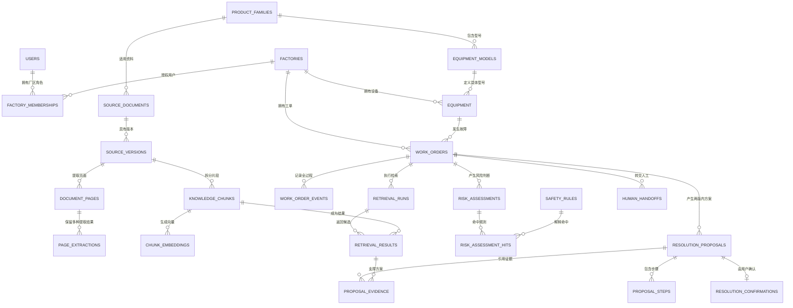

# 数据库模型第一版

- 设计日期：2026-08-17
- 依据：工单业务流程第一版、设计决定001—005、数据库规则R01—R14
- 状态：核心方向已通过阶段审查，尚未全部实现

## 1. 设计目标

数据库必须同时回答五类问题：

1. 谁在什么厂区操作哪台设备？
2. 一张工单从创建到关闭经历了什么？
3. AI检索并采用了哪份官方资料的哪段原文？
4. 为什么某项方案被允许、阻断或转人工？
5. 谁确认设备恢复，确认的是哪一版方案？

表结构服务于这些问题，不以“表越少”或“表越多”为目标。

## 2. 总体关系



## 3. 厂区、用户和权限

### `factories` 厂区

现有表保留，负责厂区身份和模拟数据标记。

关键字段：

- `id`：数据库内部主键。
- `factory_code`：业务可读厂区编号。
- `name`：厂区名称。
- `is_demo`：是否为模拟厂区。

### `users` 用户

保存本系统需要识别的人员，不自行保存密码；正式系统与外部身份系统连接。

关键字段：

- `id`
- `external_subject`：外部身份系统中的稳定编号。
- `display_name`
- `is_active`

不在用户表保存全局角色。角色属于用户与厂区之间的成员关系，因为同一个人在不同厂区可能承担不同职责。

### `factory_memberships` 厂区成员关系

一个用户可能进入多个厂区，因此不能只在用户表放一个厂区编号。

关键字段：

- `factory_id`
- `user_id`
- `role_code`：`operator`、`engineer`、`supervisor`、`admin`
- `is_active`

唯一规则：同一用户在同一厂区的同一角色不能重复。

为什么拆成独立表：它既表达多厂区授权，也为正式PostgreSQL的数据库级厂区隔离提供依据。

## 4. 设备和规范型号

### 当前问题

现有 `equipment` 直接保存：

```text
manufacturer
product_family
model_code
```

实现简单，但不同记录可能出现 `ATV320`、`ATV 320`、`atv320` 等写法，导致精确型号过滤失效。

### `product_families` 产品系列

关键字段：

- `manufacturer_name`
- `family_code`，例如 `ATV320`
- `display_name`

唯一规则：厂商名称与系列代码组合唯一。

### `equipment_models` 具体型号

关键字段：

- `product_family_id`
- `model_code`，例如 `ATV320U15N4C`
- `display_name`
- `is_active`

唯一规则：同一系列内具体型号代码唯一。

### `equipment` 现场设备

改造后保存：

- `factory_id`
- `equipment_model_id`
- `asset_code`
- `operational_status`
- `is_demo`

厂商、系列和型号通过规范型号关联得到。导入时的原始型号文字可以另存为 `raw_model_text`，便于发现输入错误，但不能用它做正式过滤。

## 5. 官方资料和知识片段

### `source_documents` 逻辑资料

表示“一份资料是什么”，例如《ATV320编程手册》。正式适用范围使用 `product_family_id` 连接规范产品系列；旧数据中的自由文本系列改名为 `raw_product_family`，只用于追溯导入原文，不能作为检索过滤依据。

同一发布机构和文件编号在去除前后空格、忽略大小写后只能登记一次。资料类别第一版只允许：

- `official_manual`：官方手册；
- `official_datasheet`：官方数据表；
- `official_service_bulletin`：官方维修通告；
- `official_safety_notice`：官方安全通知。

### `source_versions` 资料版本

表示这份资料的某个语言和版本。版本记录不可覆盖。

关键字段：

- `source_document_id`
- `version_label`
- `language_code`
- `publisher_page_date`：厂商下载网页标注的日期；
- `document_issue_label`：PDF 内部印刷的版次或日期标记；
- `acquired_at`
- `sha256`
- `local_path`
- `version_status`：待审核、当前有效、已被取代或已撤回

唯一规则：同一资料、版本、语言和文件指纹不能重复。

新导入版本默认是“待审核”，不能直接参与正式建议。经人工核验后才能成为“当前有效”；同一逻辑资料的同一种语言只允许一个当前有效版本，旧版本继续保留为“已被取代”，不覆盖、不删除。

厂商网页日期和 PDF 内部版次必须分开保存。例如本项目的下载网页写 `2025-07-04`，PDF 封面写 `07/2024`。二者可以同时为真，不能让导入程序覆盖或猜测其中一个。

### `document_pages` 页面身份

关键字段：

- `source_version_id`
- `pdf_page_number`：从 PDF 第一张页面开始计算的稳定页序号；
- `printed_page_label`：可选的纸面页码，不能代替 PDF 页序号。

页面身份和提取文字不放在同一行，因为同一页以后可能同时产生基础文字提取、版面解析和光学识别结果。页面只登记一次，提取结果可以并存。

### `page_extractions` 页面提取结果

关键字段：

- `document_page_id`
- `extraction_method`：内嵌文字、光学识别或人工转录；
- `extractor_name`、`extractor_version`、`extractor_config_sha256`；
- `extraction_status`：已提取、空白、需要光学识别或失败；
- `extracted_text`、`text_sha256`；
- `extracted_at`。

同一页面、同一工具版本和同一配置只能有一条结果；不同工具的结果可以并存，便于比较，不能静默覆盖。本轮使用 `pypdf 6.10.0` 建立基础结果：440 页中 437 页含可提取文字，PDF 第 14、436、439 页经视觉抽查确认为空白。基础提取不是最终知识片段，表格结构、阅读顺序和扫描页以后仍需按抽样结果使用 Docling 或光学识别补充。

### `knowledge_chunks` 知识片段

迁移 012 和 014 已实现：

- `source_version_id`、`chunk_no`：资料版本和片段顺序；
- `original_text`：机器提取或切分得到的原始内容，不能被人工修正覆盖；
- `content_kind`：故障定义、阈值、复位条件、步骤、诊断依据、安全警示或限制性设置；
- `source_severity`：记录官方原文的普通说明、注意、小心、警告或危险标识；
- `usage_policy`：仅供查阅、低风险指导或工程师专用；
- `review_status`：待审核、已通过或已驳回；
- `verified_text`、`reviewed_by_user_id`、`reviewed_at`、`review_notes`：人工核对正文和完整审核留痕；
- `chunking_method`：历史无版本、人工选择、结构规则或模型提议；
- `chunker_name`、`chunker_version`：产生片段边界的程序或界面及版本；
- `legacy_risk_label`：升级前自由风险标签的历史值，只为数据保留，不再作为正式判断依据。

已实现的关键规则：新片段默认进入保守待审核状态；带小心、警告或危险标识的原文不能用于低风险指导；没有完整分类、核对正文、审核人、时间、理由和可复现切片证据的片段不能通过。机器原文必须等于来源摘录按顺序拼接的结果，模型不能把总结冒充为原文。

下一轮仍需实现：

- 用规范 `equipment_model_id` 代替 `applicable_model` 自由文字；
- 把迁移 003 中的旧内联向量字段迁移到独立 `chunk_embeddings` 表。

第一周约定：

- `equipment_model_id`为空表示适用于资料所属的整个产品系列。
- 不为空表示只适用于该具体型号。
- 如果以后出现一段内容适用于多个离散型号，再增加关联表，不在第一周提前复杂化。

### `knowledge_chunk_sources` 片段来源关系

迁移 013 和 014 已实现。一个知识片段可以连接一条或多条具体页面提取结果，也可以连接同一页中多个不相邻的精确范围。

关键字段：

- `knowledge_chunk_id`：知识片段；
- `source_version_id`：共同资料版本；
- `document_page_id`：PDF 页面身份；
- `page_extraction_id`：具体工具、版本和配置产生的结果；
- `source_order`：多来源顺序；
- `start_character`：从1开始且包含的起点；
- `end_character`：不包含的终点；
- `source_excerpt`：该范围内的逐字原文。

三层组合外键分别保证片段与版本、页面与版本、提取结果与页面一致。来源顺序必须为正且在同一片段中唯一；同一片段、同一提取结果和同一页内范围不能重复。数据库用保存的页面正文重新截取并与摘录逐字比较。

已通过知识必须至少有一条来源，来源顺序从1连续，机器原文与来源拼接结果一致。页面提取结果不可更新或删除；片段一旦通过或驳回，片段及来源关系都被冻结。

TypeScript 候选创建服务不接收自由机器原文，只接收页面提取编号和逐字摘录；找不到或出现多次都拒绝。真实集成测试已从 NVE41300 第50、72、310、329和385页创建6组待审核候选、8条精确来源。

### `chunk_embeddings` 片段向量

向量从 `knowledge_chunks` 中拆出。

关键字段：

- `knowledge_chunk_id`
- `provider_name`
- `model_name`
- `dimensions`
- `distance_metric`
- `embedding`
- `created_at`

唯一规则：一个片段对同一向量模型只能有一条当前向量。

为什么拆表：同一知识片段可以使用两个向量模型做效果比较，不需要覆盖旧向量或复制原文。

当前不建立HNSW或IVFFlat索引。先用小数据精确计算相似度，实际测出延迟问题后再决定。

## 6. 工单和全过程

### `work_orders` 工单

只保存工单当前状态和核心身份，不把全过程塞在一行中。

关键字段：

- `work_order_no`
- `factory_id`
- `equipment_id`
- `created_by_membership_id`
- `status`
- `reported_fault_code`
- `created_at`
- `resolved_at`
- `closed_at`
- `is_demo`

工单中的设备和厂区继续使用联合外键，防止串厂区。

创建人保存厂区成员编号而不是单独保存用户编号。这样一条外键可以同时证明“是谁、以哪个厂区成员身份创建”，而用户身份仍可通过成员关系关联得到。

### `work_order_events` 工单事件

追加保存全过程，原则上不修改旧事件。

关键字段：

- `work_order_id`
- `factory_id`
- `event_type`
- `actor_kind`：用户、工程师、AI或系统规则
- `actor_membership_id`：用户事件必须保存厂区成员身份；AI和系统事件为空
- `content`
- `from_status`
- `to_status`
- `details`：只放不常查询的补充信息
- `occurred_at`
- `idempotency_key`：防止网络重试生成重复事件

核心业务内容使用普通列；可变的附加信息才使用JSONB。

创建草稿工单和第一条事件必须在同一短事务中完成。调用大模型或下载资料不能放在这个事务内。

## 7. 检索过程和引用证据

### `retrieval_runs` 一次检索

保存：

- 对应工单
- 用户原始问题
- 强制使用的厂区、产品系列和具体型号
- 故障码
- 检索策略版本
- 向量模型
- 开始、结束时间
- 成功或失败状态

### `retrieval_results` 检索候选结果

保存每次检索找到的候选片段，而不仅是最终答案。

关键字段：

- `retrieval_run_id`
- `knowledge_chunk_id`
- `rank_no`
- `keyword_score`
- `vector_score`
- `combined_score`
- `is_selected`
- `selection_reason`

唯一规则：一次检索中的同一知识片段不能重复出现。

最终方案的证据通过 `proposal_evidence` 指向这里，从而能还原“检索到了什么”和“最后采用了什么”。

## 8. 高危规则和风险判断

### `safety_rules` 预设阻断规则

关键字段：

- `rule_code`
- `name`
- `risk_level`
- `required_action`：阻断、转人工或提醒
- `match_config`：规则配置，适合使用JSONB
- `source_kind`：厂商资料或本项目安全策略
- `source_chunk_id`：如果来自厂商资料则保存证据
- `is_active`
- `rule_version`

规则不能只写在提示词里，否则修改后无法审计。

### `risk_assessments` 一次风险判断

保存：

- 对应工单和可选方案
- 总体风险等级
- 是否阻断
- 判断方式：确定性规则、AI辅助或人工
- 使用的模型和提示词版本
- 判断时间

### `risk_assessment_hits` 命中的规则

保存具体命中了哪条规则、哪段用户文字以及解释。这样“高危”不是一个无法解释的标签。

## 9. 两版方案、确认和人工转交

### `resolution_proposals` 处理方案

关键字段：

- `work_order_id`
- `proposal_version`：只能为1或2
- `previous_proposal_id`：第二版指向第一版
- `basis_observation_event_id`：第二版绑定第一版失败事件
- `risk_assessment_id`与`search_run_id`
- `summary`
- `confirmed_facts`
- `assumptions`
- `steps`
- `stop_conditions`
- `expected_observations`
- `content_sha256`
- `model_id`、`model_version`与`prompt_version`
- `created_at`

唯一规则：同一工单的方案版本号和正文摘要不能重复，版本号范围只能为1或2；第一版不能伪造前版或反馈依据，第二版必须同时提供二者。

### 为什么当前没有拆出`proposal_steps`

早期设计准备把每个步骤拆成独立行。实现时改为把事实、假设、步骤、停止条件和预期观察分别保存为非空`jsonb`数组，因为当前方案是一个有界、不可变、总是整体展示和整体确认的小文档，业务查询不会单独筛选第几个步骤。这样可以减少多表写入和半份方案。

数据库负责数组类型和非空，TypeScript负责每项非空和禁用动作扫描。如果未来需要逐步签到、不同步骤分别授权或统计步骤风险，再把步骤规范化成独立表，不能用当前数组逃避新的查询需求。

### `resolution_proposal_evidence` 方案证据

把方案与被选中的检索命中连接起来。方案和命中都带`search_run_id`，复合外键保证它们属于同一次检索。没有证据的方案不能进入“等待用户确认”。

### `proposal_user_feedback` 现场反馈

保存：

- 对应方案和工单
- 确认用户
- `resolved`或`not_resolved`
- 实际执行结果
- 确认时间

反馈只追加。普通工单由现场用户确认恢复；第一版未恢复时工单回到排查中，第二版未恢复时在同一事务中创建人工接管。高危路径不会进入普通方案确认。

### `human_handoffs` 人工转交

保存：

- 对应工单
- 转交原因：高危、资料不足、两版失败或其他
- 相关风险判断
- 被指派工程师
- 接单状态
- 接单、处理和完成时间
- 人工处理结论

第一周允许把一次转交的最终结论保存在同一记录；如果未来出现多人协作和多次处理，再拆出人工处理事件表。

## 10. 状态变化由谁保证

单行检查约束适合保证状态值合法，但无法单独完成“操作者具有某厂区工程师角色”“高危工单已有人工处理记录”等跨表判断。

因此采用三层保障：

1. 数据库检查约束限制状态值和基础字段。
2. 统一的状态转换服务检查当前状态、目标状态、用户角色、方案、风险和确认记录。
3. 数据库事务同时更新当前状态并追加工单事件。

正式PostgreSQL再增加行级权限策略，防止应用程序漏写厂区过滤条件。PGlite阶段验证表结构和转换规则，不冒充多连接生产权限测试。

## 11. 第一版索引依据

索引来自具体查询，不凭感觉添加：

| 主要查询 | 候选索引 |
|---|---|
| 某厂区按状态查看最近工单 | `work_orders(factory_id, status, created_at desc)` |
| 按厂区和设备编号找设备 | `equipment(factory_id, asset_code)` 唯一索引 |
| 查看一张工单全过程 | `work_order_events(work_order_id, occurred_at)` |
| 查看资料版本页面 | `document_pages(source_version_id, pdf_page_number)` 唯一索引 |
| 比较一页的多种提取结果 | `page_extractions(document_page_id, extraction_method, extractor...)` 唯一索引 |
| 查看资料版本片段 | `knowledge_chunks(source_version_id, chunk_no)` 唯一索引 |
| 查看一次检索排序结果 | `retrieval_results(retrieval_run_id, rank_no)` |
| 查看工单方案版本 | `resolution_proposals(work_order_id, proposal_version)` 唯一索引 |
| 查看等待处理的人工转交 | `human_handoffs(status, created_at)` |

所有外键列都需要检查是否有可用索引，因为PostgreSQL不会自动为外键建立索引。

## 12. 中文关键词检索边界

PostgreSQL内置全文检索示例主要适合有明确分词规则的语言。中文资料不能直接照搬英文配置后宣称效果良好。

第一周做法：

- 故障码、型号和参数名使用精确匹配。
- 中文关键词先使用经过测试的分词或词项字段。
- 与向量精确检索合并排序。
- 用测试集比较纯关键词、纯向量和混合检索。
- 没有评测结果前不提前宣布某种中文全文检索方案。

## 13. 现有数据库审查

### 可以保留

- `factories` 主体结构。
- `equipment` 与厂区的关系及联合工单约束。
- `work_orders` 基础身份。
- `source_documents`、`source_versions`、`knowledge_chunks` 的来源主干。
- `bigint identity`、`text`、`timestamptz` 和外键索引原则。

### 需要改造

- 增加用户和厂区成员关系。
- 自由文本型号改为规范型号关联。
- 工单状态增加允许值和转换规则。
- 资料版本增加防重复约束和版本状态。
- 已增加页面身份和多版本页面提取记录。
- 已增加知识片段三维分类、原文与核对正文并存、通过/驳回审核留痕。
- 已增加片段到具体页面提取结果的来源关系、审核前来源门禁和审核后冻结。
- 已增加结构切片元数据、页内精确范围、逐字核对触发器和候选创建服务。
- 已把向量从知识片段拆到可容纳多模型版本的独立表。
- 已增加检索运行、检索命中、风险规则、风险判断和具体命中。
- 已增加两版方案、具体证据、现场反馈和人工接管。
- `applicable_model` 自由文本改为规范型号关联。

### 尚未实现

- 真实身份中间件注入可信成员身份。
- 人工工程师接单、处理中和完结的完整服务层。
- 大规模真实千问多轮轨迹评测；当前只完成两个基础动作的真实联网测试。
- 正式PostgreSQL厂区级权限策略。

## 14. 三天项目实施边界

三天内必须实现并测试：

- 厂区、用户角色、规范型号和设备。
- 资料、版本、页面、片段和多模型向量记录。
- 工单、事件和合法状态变化。
- 检索过程、候选结果和引用证据。
- 安全规则、风险判断和高危转人工。
- 最多两版方案、现场确认和人工处理。

明确不在第一周伪装完成：

- 真实企业账号系统。
- 正式服务端多连接并发验证。
- 生产级行级权限部署。
- 大规模近似向量索引。
- 企业消息通知和排班系统。
- 自动执行任何现场维修动作。

## 15. 后续迁移顺序

后续不一次写完所有SQL，而是继续测试优先：

1. 用户、厂区角色与规范型号。
2. 工单状态和全过程事件。
3. 资料防重复、页面身份和多版本提取结果（已完成）。
4. 检索运行与候选结果。
5. 安全规则与风险判断。
6. 两版方案、步骤、证据和用户确认。
7. 人工转交与关闭完整性。

每一步都先写能够暴露错误的反向测试，再增加最小迁移。
