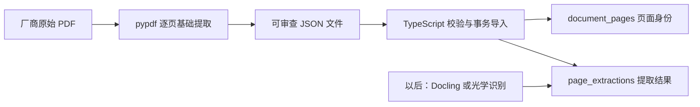

# 设计决定 009：页级原文与多种提取结果并存

- 日期：2026-08-18
- 状态：已通过测试实现
- 适用范围：NVE41300 PDF 到数据库页面资料层

## 要解决的问题

Agent 以后引用手册时，必须能回答：原始文件是哪一个、来自 PDF 第几页、用什么工具和版本提取、提取后有没有被改变。只保存整份 PDF 路径或一份合并后的纯文字，都无法回答这些问题。

## 考虑过的方案

### 方案一：把提取文字直接写进页面表，后来的结果覆盖旧结果

优点是表少。缺点是 pypdf、Docling 和光学识别无法比较；工具升级后旧结果消失，已经生成的工单也无法还原当时采用的原文。

### 方案二：全部页面先转图片，再统一做光学识别

优点是扫描件和电子 PDF 走同一条路。缺点是本手册本来就含可复制文字，转图片后会丢掉 PDF 已有的字符编码信息，引入额外识别错误和计算成本。pypdf 官方也明确不建议对原生电子 PDF 一律先做光学识别。

### 方案三：先用轻量工具建立可复现基线，再按需要补版面解析或光学识别

页面身份只保存一次；不同提取工具、版本和配置的结果放在独立表中并存。第一轮用 pypdf 逐页读取 PDF 自带文字；表格、复杂阅读顺序或扫描页再按抽样结果使用 Docling 或光学识别。

选择方案三。

## 为什么当前没有直接用 Docling 替代基础提取

Docling 能识别页面布局、阅读顺序和表格结构，适合把复杂资料整理成结构化内容。但“功能更多”不等于“每页都应先跑更重的处理”。本轮先回答最基础、可客观核验的问题：文件是否一致、页面是否连续、哪些页有 PDF 自带文字、文字有没有在传输中改变。

Docling 会作为第二种提取结果写入同一页，而不是覆盖 pypdf 结果。之后用 OHF 相关页和表格页做对照，只有质量提升能被样本证明时，才把它用于知识片段生成。

## 数据流

Python 只负责离线资料准备；TypeScript 负责本项目的数据校验和数据库事务。Agent 以后不直接打开未经审核的 PDF，而是从带来源、页码和指纹的资料层取证。

## 数据库和导入程序负责保证什么

- 原始 PDF 的 SHA-256 必须与已登记版本一致；
- PDF 页码必须从 1 开始连续，不能缺页或重复；
- 每页文字的 SHA-256 必须由导入程序重新计算；
- 页面身份和提取结果必须在同一事务中整批写入，任一页失败全部回滚；
- 相同工具、版本和配置重复导入不产生副本；
- 相同提取身份如果出现不同文字，必须报告冲突，不能静默跳过；
- pypdf、Docling 和人工转录结果可以在同一页并存。

## 本次真实结果

- 原始手册共 440 个 PDF 页面；
- 437 页含可提取的内嵌文字；
- 第 14、436、439 页没有提取文字，渲染后视觉抽查也确认为空白；
- `OHF` 出现在 PDF 第 50、72、76、310、329、385 页；
- 第 72 页可直接找到“OHF：设备过热”，第 385 页包含故障清除和复位相关内容；
- 网页日期 `2025-07-04` 与 PDF 内部标记 `07/2024` 分栏保存，没有互相覆盖。

这些结果证明“页级资料底座可用”，不等于“所有表格和段落结构已经正确”，也不等于该版本已经审核为当前有效。

## 真实行业参照

- [施耐德电气 NVE41300 官方页面](https://www.schneider-electric.cn/zh/download/document/NVE41300/)说明这份手册用于 ATV320 的设置、编程、维护和诊断，正是本项目要处理的真实业务资料。
- [pypdf 的官方说明](https://pypdf.readthedocs.io/en/stable/user/extract-text.html)解释了电子 PDF 文字提取、扫描页光学识别和 PDF 缺少语义结构的边界，是本轮“先保真提取、后判断结构”的依据。
- [IBM Research 对 Docling 的介绍](https://research.ibm.com/blog/docling-generative-AI)给出了真实用例：InstructLab 团队用它从目标 PDF 提取资料训练模型，它也进入 IBM 的文档理解能力并服务于包括 watsonx.ai 在内的产品。
- [Docling 官方项目](https://github.com/docling-project/docling)列出的能力包括版面、阅读顺序、表格结构和光学识别，适合本项目下一轮结构抽取对照。

